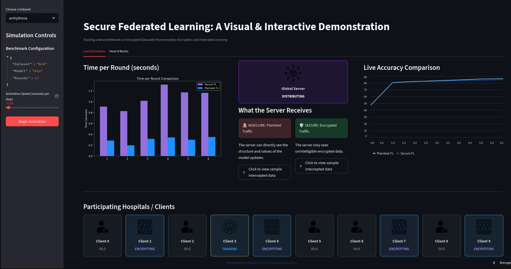

# Secure Federated Learning using Homomorphic Encryption
Training a Neural Network on Encrypted Data with Homomorphic Encryption and Federated Learning


<a href="https://securefl.streamlit.app/" target="_blank"></a>

This project is a demonstration on training a machine learning model on distributed data using **Federated Learning (FL)**, with an added layer of privacy through **Homomorphic Encryption (HE)**.

The core principle is that raw data never leaves the client's local environment. Furthermore, model updates are encrypted before being sent to a central server. The server can then aggregate these encrypted updates without ever decrypting them, providing a strong mathematical guarantee of privacy.

The interactive dashboard simulates this process and compares its performance against less secure training methodologies.

### Live Interactive Demo

A live version of the dashboard is hosted on Streamlit Community Cloud.

**[Interactive Demo](https://securefl.streamlit.app/)**



---

## Table of Contents

- [About The Project](#about-the-project)
- [Key Features](#key-features)
- [Technology Stack](#technology-stack)
- [Repository Structure](#repository-structure)
- [Getting Started](#getting-started)
  - [Prerequisites](#prerequisites)
  - [Installation & Setup](#installation--setup)
- [Usage](#usage)
- [Author](#author)
- [License](#license)

## About The Project

Traditional machine learning requires centralizing data, which is often not feasible for sensitive information due to regulatory and privacy concerns (e.g., GDPR, HIPAA). This project demonstrates a solution using two key technologies:

1.  **Federated Learning (FL):** A decentralized training approach where the model is sent to the data holders (clients). Clients train the model locally, so their raw data is never exposed. They only return the learned model parameters (weights).

2.  **Homomorphic Encryption (HE):** A cryptographic method that allows computations to be performed directly on encrypted data. In this project, clients encrypt their model weights before sending them to the server. The server can then average these encrypted weights without having the decryption key. This prevents the server from inferring information from any single client's update, providing a robust privacy layer on top of FL.

## Key Features

-   **Visual Simulation of FL Process:** Animates the client selection, model distribution, local training, encryption, and secure aggregation steps.
-   **Plaintext vs. Ciphertext Comparison:** A "Privacy Sniffer" UI component that shows the data received by the server, contrasting readable plaintext updates with their unintelligible encrypted counterparts.
-   **Interactive Model Testing:** Allows users to test the final, securely-trained models on new data:
    -   **MNIST:** A drawable canvas for handwritten digit recognition.
    -   **Arrhythmia:** A diagnostic tool to classify patient data, complete with model explainability (XAI) charts from SHAP.
-   **Performance Benchmarking:** Provides charts comparing three training methods:
    1.  Secure Federated Learning (with HE)
    2.  Plaintext Federated Learning (insecure baseline)
    3.  Centralized Training (non-private performance benchmark)

## Technology Stack

-   **Backend & ML Framework:** Python, PyTorch
-   **Dashboard:** Streamlit
-   **Homomorphic Encryption:** Microsoft SEAL (via the TenSEAL wrapper)
-   **Model Explainability:** SHAP
-   **Data & Numerics:** Pandas, NumPy, scikit-learn

## Repository Structure

```
.
├── .gitignore
├── LICENSE.txt
├── README.md
├── packages.txt          # System-level dependencies for deployment
├── requirements.txt      # Python package requirements
└── src/
    ├── assets/           # Static image assets for the UI
    ├── data/             # Default directory for datasets
    ├── centralized_trainer.py
    ├── config.py
    ├── dashboard.py      # Main Streamlit application file
    ├── data_loader.py
    ├── fl_logic.py
    ├── he_tenseal.py
    ├── main.py           # Main script to run simulations
    ├── models.py
    └── utils.py
```

## Getting Started

Follow these steps to set up and run the project locally.

### Prerequisites

-   Python (version 3.11+ recommended)
-   `pip` and `venv`

### Installation & Setup

1.  **Clone the Repository**
    ```bash
    git clone https://github.com/Realm07/SecureFL.git
    cd SecureFL
    ```

2.  **Create and Activate a Virtual Environment**
    ```bash
    # Create the environment
    python3 -m venv venv

    # Activate it (Linux/macOS)
    source venv/bin/activate

    # Activate it (Windows)
    # venv\Scripts\activate
    ```

3.  **Install Dependencies**
    ```bash
    pip install -r requirements.txt
    ```

4.  **Download the Arrhythmia Dataset**
    -   Download the dataset from the [UCI Machine Learning Repository](https://archive.ics.uci.edu/dataset/5/arrhythmia).
    -   Ensure the file is named `arrhythmia.csv`.
    -   Place this file inside the `src/data/` directory. The MNIST dataset will be downloaded automatically by PyTorch.

## Usage

Before running the dashboard, you must first generate the result files that it depends on.

1.  **Generate Benchmark and Model Files**
    
    > **Note:** This step is computationally intensive and may take several minutes to complete.

    Run the following commands from the project's root directory:
    ```bash
    # Generate benchmarks for the centralized model
    python3 src/centralized_trainer.py --dataset mnist
    python3 src/centralized_trainer.py --dataset arrhythmia

    # Generate benchmarks and models for Federated Learning
    python3 src/main.py --dataset mnist
    python3 src/main.py --dataset arrhythmia
    ```

2.  **Launch the Dashboard**
    Once all result files have been generated, launch the Streamlit application:
    ```bash
    streamlit run src/dashboard.py
    ```
    The application will be accessible in your web browser at `http://localhost:8501`.

## Author

This project was developed by **Realm07**.

-   **GitHub Profile:** [https://github.com/Realm07](https://github.com/Realm07)
-   **Project Repository:** [https://github.com/Realm07/SecureFL](https://github.com/Realm07/SecureFL)

## License

This project is licensed under the MIT License. See the [LICENSE.txt](LICENSE.txt) file for details.
